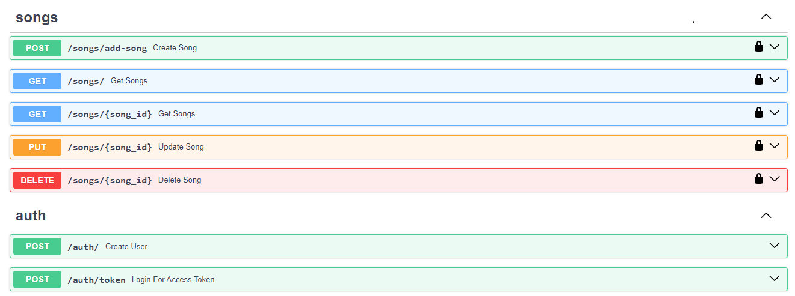

### OpenAPI Documentation

### Key Features

- **Song CRUD**: Users can add, view, update, and delete songs from the database.
- **Secure Authentication**: JWT implementation for user authentication, ensuring that only authenticated users can modify the song collection.
- **RESTful Interface**: The application follows REST principles, allowing for simple and efficient interactions with the API.
- **SQLite Database**: Utilizes SQLite as the database management system, providing lightweight and efficient storage.

### Technologies Used

- **Python**: The primary programming language for backend development.
- **FastAPI**: A modern and fast framework for building APIs with Python, enabling high efficiency and performance.
- **SQLite**: A lightweight and easy-to-use database, ideal for small to medium-sized projects.
- **JWT (JSON Web Tokens)**: For user authentication and authorization, ensuring security in transactions.
- **OAuth2**: Implementation of authentication flows to manage access to resources securely.

